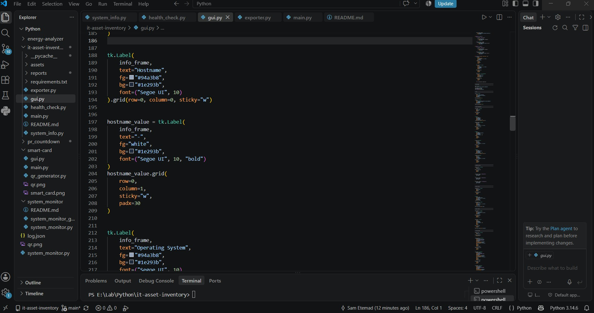

# 🖥️ IT Asset Inventory Dashboard

A Python-based Windows asset inventory and system health dashboard designed for IT support, system administration, and infrastructure monitoring.

The application collects local system information, evaluates CPU, memory, and disk utilization, generates health alerts, and exports inventory reports in JSON and CSV formats.

---

## 📸 Preview



---

## ✨ Features

- Windows system inventory collection
- Hostname and IPv4 detection
- Operating system identification
- Real-time CPU utilization monitoring
- RAM utilization monitoring
- Disk utilization monitoring
- Health evaluation engine
  - HEALTHY
  - WARNING
  - CRITICAL
- Automated health alerts
- Interactive Tkinter GUI dashboard
- Manual system-data refresh
- JSON report export
- CSV report export
- Timestamped inventory reports

---

## 🛠️ Tech Stack

- Python 3
- Tkinter
- psutil
- JSON
- CSV

---

## 🧩 Project Architecture

```text
it-asset-inventory/
│
├── main.py
├── gui.py
├── system_info.py
├── health_check.py
├── exporter.py
├── requirements.txt
├── README.md
├── .gitignore
│
├── assets/
│   └── dashboard-preview.png
│
└── reports/
    ├── asset_report_*.json
    └── asset_report_*.csv